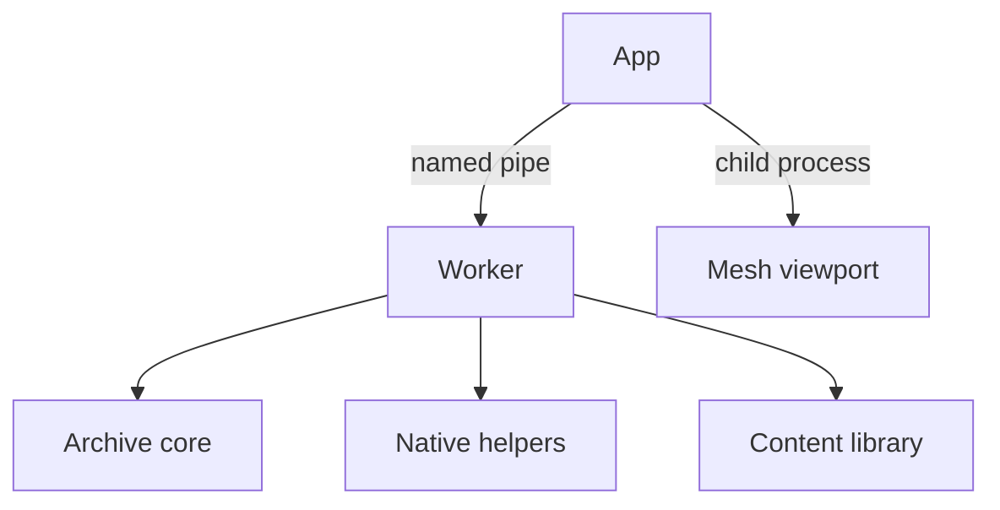
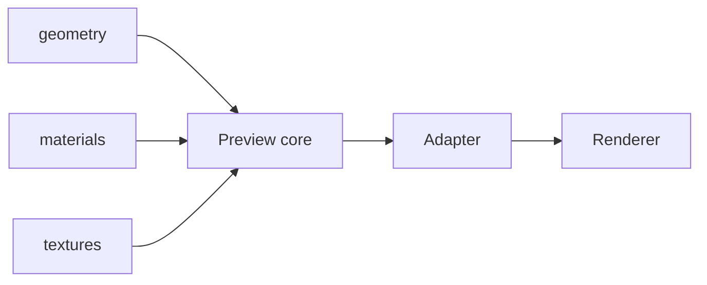

# CDMW Archive Lite

[](https://github.com/Ratty123/CDMW-Lite/actions/workflows/archive-lite.yml)


CDMW Archive Lite is a standalone, read-only Windows desktop application for browsing Crimson Desert PAMT/PAZ archives. It can search, inspect, preview, and export archive content without modifying the source archives.

The application is self-contained in this repository and keeps archive queries, decoding, media conversion, and mesh rendering outside the UI process.

## Highlights

- Browse large archives through a folder tree or a flat list, with an optional category navigator, paging, filters, sorting, and persistent indexes.
- Search text across archives or loose folders with cancellation, result limits, and in-file navigation.
- Find known items by localized name and follow exact or related archive links.
- Preview text, XML, images, DDS textures, supported media including the sounds a Wwise `.bnk` embeds, archive metadata, and read-only PAC/PAM/PAMLOD/PAT geometry.
- Discover and export associated assets without altering game data.
- Run as a portable Windows application or a single self-extracting executable.
- Switch the interface between the fourteen languages Crimson Desert itself ships; every one but English is machine translated and unreviewed.
- Keep settings, caches, logs, and crash reports isolated from the full CDMW workbench.

## Safety boundary

Archive Lite has no archive-write, replacement, patching, backup, restore, or mod-building authority. PAMT, PAZ, and PATHC sources are opened read-only, and exports are written to a separate destination selected by the user.

The repository does not contain game archives, extracted game assets, or other local game data.

## Requirements

- Windows 11 x64
- .NET 10 SDK
- CMake 3.24 or newer
- Visual Studio 2022 Build Tools with the Desktop C++ workload
- PowerShell

Pinned third-party sources are documented in [DEPENDENCY-SOURCES.md](DEPENDENCY-SOURCES.md).

## Run from source

First run the focused nonvisual gate:

```powershell
.\scripts\test_archive_lite.ps1 -Configuration Debug
```

Then launch the desktop application:

```powershell
dotnet run --project .\src\Cdmw.ArchiveLite.App\Cdmw.ArchiveLite.App.csproj -c Debug
```

The launch command opens a visible desktop window and is intentionally separate from automated validation.

## Build

For a fresh standalone executable, run:

```text
BUILD-FRESH-EXE.bat
```

For the complete verified Release package:

```powershell
.\scripts\build_archive_lite.ps1
```

Build outputs are written beneath the ignored `artifacts/` directory. On a clean checkout, pinned native dependencies are downloaded into the ignored `.tools/` directory.

## Architecture



| node | process or library | responsibility |
| --- | --- | --- |
| App | `CdmwArchiveLite.exe` | WPF presentation and selection state |
| Worker | `CdmwArchiveLite.Worker.exe` | archive queries, search, preview, export |
| Mesh viewport | `cdmw-mesh-dotnet-editor.exe` | read-only Vortice D3D11 rendering |
| Archive core | `cdmw-archive-core.dll` | read-only PAMT / PAZ / PATHC decoding |
| Native helpers | helper processes | indexing, DDS, model and media preparation |
| Content library | managed | semantic archive documents |

The named pipe carries request IDs and cancellation. The UI owns presentation; long-running work stays cancellable in the worker or a dedicated native process, and the renderer runs in its own child process.

## Model preview

A model preview is assembled from the geometry, its material sidecar, and the textures those materials name. Crimson packs surface response into one map, so the preview reads the channels rather than guessing from a filename.



`.pac` geometry, the `.pac_xml` material sidecar, and the `.dds` textures it names go to the preview core, which assigns each binding a role, selects a slot per submesh, and resolves colour layers. The adapter turns that into channels, packed components, and layer bindings; the renderer samples them.

| suffix | role | notes |
| --- | --- | --- |
| `X.dds` | albedo | the part's own colour |
| `X_n.dds` | normal | two-channel BC5; Z is rebuilt |
| `X_sp.dds` | surface response | **G** roughness, **B** metalness |
| `X_ma.dds` | colour-blending mask | selects among colour layers, not a response map |
| `X_emi.dds` | emissive intensity | single-channel BC4; the colour is authored, not sampled |
| `X_disp.dds` | height | |
| `X_f.dds` | strand direction | orients the anisotropic hair highlight |

Preview output is checked against the assets themselves rather than by eye. [PREVIEW-MATERIAL-AUDIT.md](PREVIEW-MATERIAL-AUDIT.md) records the method, what is confirmed authored, and which explanations were refuted.

| measured over | result |
| --- | --- |
| brightness reproduced vs. the asset's own textures | **0.982** (1.000 = exact) |
| colour reproduced vs. the asset's own textures | **0.926** |
| lighting preserves albedo, lit/unlit over 728 assets | **0.97 – 1.01** |
| equipment assets rendered and compared | **~5,400** |
| whole-corpus scans of all 12,340 equipment PACs | **4** |

## Verified behaviour

These are asserted by the focused gate, not measured by hand. `scripts/test_archive_lite.ps1 -Configuration Debug` reproduces them.

| | |
| --- | --- |
| focused scenarios | 48, covering archive, preview, export, worker lifetime and cache eviction |
| model preview, cold cache | ~100 ms |
| model preview, warm cache | ~1 ms, and warm across sessions |
| renderer | headless GPU soak, production D3D11 backend, windows stay hidden |
| archive access | read-only; export is contained, atomic and manifested |

## Repository layout

- `src/` — WPF application, worker, shared contracts, and managed archive services
- `native/` — read-only archive and preview implementations
- `tools/` — repository-owned helper and renderer projects
- `tests/` — managed regression coverage and synthetic fixtures
- `scripts/` — focused validation and packaging entry points
- `schemas/` — versioned repository-owned data contracts
- `.github/` — GitHub Actions, dependency update configuration, and collaboration templates

## Local data

Portable builds keep settings, caches, logs, and crash reports beside the executable. The single-file launcher extracts its verified runtime beneath `%LocalAppData%\CDMW\CDMWArchiveLite\standalone\`; it does not place user settings, game data, or exports there.

These paths and all build outputs are excluded from version control.

## Project documents

- [TESTING.md](TESTING.md) - validation matrix and proof boundaries
- [PREVIEW-MATERIAL-AUDIT.md](PREVIEW-MATERIAL-AUDIT.md) - how a preview is checked against its source, what is confirmed authored, and which explanations were refuted
- [CONTRIBUTING.md](CONTRIBUTING.md) - development and review expectations
- [SECURITY.md](SECURITY.md) - supported versions and private reporting
- [CHANGELOG.md](CHANGELOG.md) - notable version changes
- [THIRD-PARTY-NOTICES.md](THIRD-PARTY-NOTICES.md) - bundled component notices

## License

[MIT](LICENSE). Bundled third-party components keep their own licences, listed in
[THIRD-PARTY-NOTICES.md](THIRD-PARTY-NOTICES.md).

Archive Lite reads game files that it never ships. It contains no Crimson Desert content, and the
archives it opens stay read-only. Whatever you export from your own installation remains subject to
the game's own terms.
